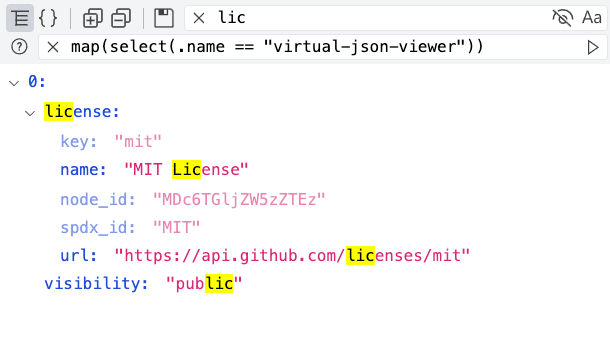

#  Virtual Json Viewer

Browser plugin that uses [virtual DOM](https://github.com/Lodin/react-vtree) to render JSONs with built-in search, [JQ filtering](https://stedolan.github.io/jq)\* and many other [features](#features).



\* JQ availability is currently subject to website CSP. See [here](https://github.com/paolosimone/virtual-json-viewer/issues/15) for further details

## Why?

> "Oh my! There are plenty of json viewers, why making a new one?"

Rightful question, and the answer is quite simple: the others weren't good enough [for my needs].  

I am a backend developer and in my everyday job I have to debug large json payloads, 
so large that every other plugin for chrome I tried freezed without showing any content.

> "Good for you, but **my** payloads are small, pretty and strawberry flavoured"

That's ok, if you are happy with your current plugin, no need to change.  

And if you want to come back later don't worry, we'll still be here, with blazing fast loading time, 
built-in search, JQ filtering and many other features... but no strawberries, sorry

## Browser Store

[](https://chrome.google.com/webstore/detail/virtual-json-viewer/cipnpfcceoapeahdgomheoecidglopld)

Note: the extension is currently not available on Firefox Add-ons Store, but it can be [manually installed](#manual-installation).

## Manual Installation

### Get the build

__From Release__

1. Download the latest build from the [release page](https://github.com/paolosimone/virtual-json-viewer/releases)
1. Extract the content

__From source__

```bash
cd extension
yarn install
yarn build
```

### Install the extension

__Chrome__

1. Open the Extension Management page by navigating to `chrome://extensions`
1. Enable Developer Mode by clicking the toggle switch next to Developer mode
1. Click the load unpacked button and select the `build` directory

__Firefox__

Open the `manifest.json` inside the `build` directory and add a custom extension id ([but why?](https://extensionworkshop.com/documentation/develop/extensions-and-the-add-on-id/#when_do_you_need_an_add-on_id))
```json
"browser_specific_settings": {
  "gecko": {
    "id": "id@virtualjsonviewer.com"
  }
}
```

Disable native json viewer

1. Go to `about:config`
1. Search for `devtools.jsonview.enabled`
1. Set to false

Load extension

1. Go to `about:debugging`
1. Click "This Firefox"
1. Click "Load Temporary Add-on" and select the `build` directory

*Note:* The extension is automatically removed when Firefox is closed and must be manually loaded on next start.

__Others__

The extension has not been tested on other browsers, but should work on any chromium browser.

## Features

- [X] JSON rendering using virtual DOM and collapsable nodes
    - [X] Sort JSON keys alphabetically
    - [X] Preview nested item count for closed nodes
    - [X] Color-encoded value types
    - [X] Collapse/expand all nodes
- [X] Full text search
    - [X] Highlight search results
    - [X] Option to completely hide subtrees without any search match
    - [X] Option to enable case sensitive search
- [X] JQ filtering
- [X] Raw JSON viewer
    - [X] Prettify/minify 
- [X] Download JSON
- [X] Dark mode
- [X] Internationalization
- [X] Customizable settings

## Contributing

__Bug fix__

In the rare event (🤥) of a bug, please [open an issue](https://github.com/paolosimone/virtual-json-viewer/issues/new) with detailed description of what happened and how to reproduce it... Or just open a PR with the patch if you are brave enough!

__Feature request__

In general I'd rather keep the feature set of Virtual Json Viewer small and well defined, but if you have a proposal feel free to [open an issue](https://github.com/paolosimone/virtual-json-viewer/issues/new) and we will discuss it.

__Translation__

New languages are welcome, open a PR and follow these steps.

Translation files are in json format (yo dawg!) and are located in the translation folder `extension/src/viewer/localization/translations`.

To add a new language:

1. Make a copy of the `en.json` translation file and rename it with the [ISO 639-1](https://en.wikipedia.org/wiki/ISO_639-1) two-letter code of the new language (e.g. `es.json` for Spanish)
1. Translate all the values in the new translation file
1. Register the new language by adding it to the enum (and other structures) inside `extension/src/viewer/localization/Localization.ts`

## Local development

Run `yarn start` to serve the extension as a web app with hot reload.

Always `yarn format` before creating a commit.

## Performance

*Disclaimer*: this is NOT a formal benchmark, just a few tests with syntethic data to give an idea of loading performance time.

**Setup**
- Macbook Pro 16 (2019) 2,6 GHz 16 GB
- Chrome 95.0.4638.69
- Jsons are randomly generated using [this script](https://gist.github.com/paolosimone/437ba2e9675bafcc914b587d53fab0b3) (fixed dept: 10)
- Files are loaded from disk
- Load time recorded with Chrome DevTool
    1. Open file in chrome
    1. Click "Start profiling and reload page" 
    1. Take the end of the last frame 

**Results**

| Siblings per level | File Size      | Load time       |
|--------------------|----------------|-----------------|
| 110                | ~100 KB        | ~250 ms         |
| 1100               | ~1 MB          | ~350 ms         |
| 11000              | ~10 MB         | ~1200 ms        |
| 110000             | ~100 MB        | ~10 s           |

## References

|Tool                                                                                                                       |Usage                                          |
|---------------------------------------------------------------------------------------------------------------------------|-----------------------------------------------|
|[cra-template-complex-browserext-typescript](https://github.com/hindmost/cra-template-complex-browserext-typescript)       |Project scaffolding, huge help!                |
|[customize-cra](https://github.com/arackaf/customize-cra)                                                                  |Break webpack config, then fix it              |
|[jq-wasm](https://github.com/paolosimone/jq-wasm)                                                                          |JQ in the browser                              |
|[json-stable-stringify](https://github.com/substack/json-stable-stringify)                                                 |Sort keys on JSON serialization apparently is rocket science|
|[React](https://reactjs.org/)                                                                                              |Learn how to write a frontend application without jQuery and bootstrap|
|[react-vtree](https://github.com/Lodin/react-vtree)                                                                        |Render the JSON. I'd say it's a pretty important role|
|[TailwindCSS](https://tailwindcss.com/)                                                                                    |Prevent me from touching CSS files|
|[Typescript](https://www.typescriptlang.org/)                                                                              |Try to forget I'm actually writing JS 🤢|
|[uid](https://github.com/lukeed/uid)                                                                                       |Fast generation of unique keys for [React lists](https://reactjs.org/docs/lists-and-keys.html#keys) |
|[vscode-icons](https://github.com/microsoft/vscode-icons)                                                                  |Keep UI buttons clean and intuitive|


## License

MIT License